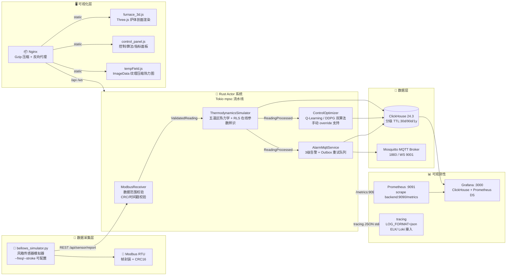
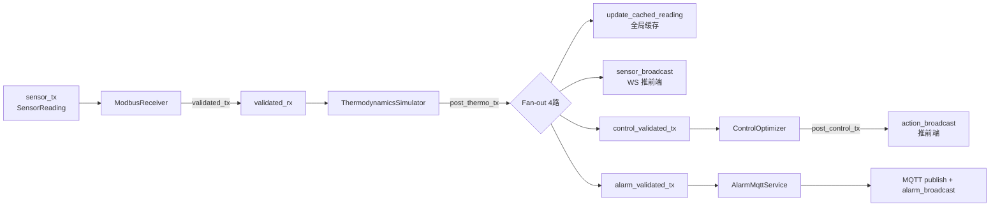

# 古代风箱鼓风冶铁过程热力学模拟与炉温控制仿真系统

面向冶金史团队的**汉代炒钢炉 (HAN-001) 与明代高炉 (MING-001) 复原研究平台**。基于 Rust Actor 模型 + ClickHouse 时序存储 + 强化学习控制 + Three.js 3D 可视化，实现每 10s 粒度的 Modbus RTU 传感器采集、热力学仿真、Q-Learning/DDPG 双算法炉温优化与 MQTT 告警推送。

---

## 一、系统架构



### Actor 通道拓扑（14 条 mpsc + 3 条 broadcast）



---

## 二、目录结构

```
.
├── backend/                      # Rust 后端 (Axum + Tokio Actor)
│   ├── Cargo.toml                # dependencies: tokio, axum, clickhouse 0.12,
│   │                             #   rumqttc 0.23, metrics, tracing, qlearning, ndarray
│   ├── Dockerfile.backend        # multi-stage: cargo-chef -> debian:bookworm-slim
│   └── src/
│       ├── main.rs               # 组装 14 条通道 + tokio::select! 5 任务优雅退出
│       ├── config.rs             # 9 配置结构体 + SystemConfig::from_env() 参数外置
│       ├── metrics.rs            # Prometheus 计数器/仪表盘（22 指标）
│       ├── modbus_receiver.rs    # Actor: 校验/统计/范围/CRC
│       ├── thermodynamics_simulator.rs # Actor: 热力学 + RLS 参数辨识
│       ├── control_optimizer.rs  # Actor: QL/DDPG 门面 + 手动 override
│       ├── alarm_mqtt.rs         # Actor: 告警分级 + Outbox 重试
│       ├── parameter_id.rs       # RLS 递推最小二乘 λ=0.995
│       ├── qlearning.rs          # 96 桶 × 25 动作离散 Q-Learning
│       ├── rl_control.rs         # 10 维状态 × MLP(128) DDPG
│       ├── thermodynamics.rs     # Arrhenius + 五温区能量守恒
│       ├── api.rs                # Axum 路由 + AppState 双路径（Actor/兼容）
│       ├── storage.rs            # ClickHouse 访问层
│       ├── mqtt.rs               # MqttPublisher + AlarmDetector
│       └── models.rs             # 数据模型（SensorReading/AlarmEvent/ThermoParams...）
│
├── frontend/                     # Three.js + ES Modules 前端
│   ├── Dockerfile.frontend       # nginx:1.27-alpine + Gzip
│   ├── nginx.conf                # gzip_comp_level=6, /api /ws 反代
│   ├── index.html
│   ├── css/style.css
│   └── js/
│       ├── app.js                # 总装：实例化所有模块 + 事件胶水
│       ├── client.js             # ApiClient + WSClient
│       ├── furnace3d.js          # Three.js 炉体剖面
│       ├── control_panel.js      # 控制面板独立组件（on() 事件机制）
│       ├── bellows.js            # 风箱 Canvas 动画
│       ├── tempField.js          # 纹理压缩 2x/4x 热力图
│       └── tempChart.js          # 温度历史折线
│
├── simulator/
│   ├── Dockerfile.simulator      # python:3.12-slim
│   ├── requirements.txt
│   └── bellows_simulator.py      # --freq/--stroke/--freq-noise/--follow-rl
│
├── clickhouse/
│   ├── config.xml                # merge_tree.ttl_only_drop_parts=1, 8G 内存
│   └── init.sql                  # schema + 分级 TTL + 物化视图 + 初始数据
│
├── mosquitto/
│   └── mosquitto.conf            # 1883 + WS 9001, allow_anonymous true
│
├── prometheus/
│   └── prometheus.yml            # 每10s 抓取 backend:9090/metrics
│
├── grafana/
│   └── provisioning/             # ClickHouse + Prometheus 数据源自动配置
│
├── docker-compose.yml            # 7 services: ch/mqtt/backend/simulator/fe/prom/grafana
└── .dockerignore
```

---

## 三、快速启动

### 3.1 一键编排（推荐）

```bash
# 构建并启动全部 7 个服务
docker compose up -d --build

# 查看启动状态
docker compose ps
docker compose logs -f backend

# 验证
curl http://127.0.0.1/api/health
curl http://127.0.0.1:9090/metrics | head -50

# 停止
docker compose down -v
```

启动后访问：
| 服务 | 地址 | 默认账户 |
|---|---|---|
| 前端界面 | http://127.0.0.1 | - |
| 后端 API | http://127.0.0.1/api/* | - |
| WebSocket | ws://127.0.0.1/ws | - |
| Prometheus | http://127.0.0.1:9091 | - |
| Grafana | http://127.0.0.1:3000 | admin / metallurgy@2026 |
| ClickHouse | http://127.0.0.1:8123 | default |
| MQTT Broker | tcp://127.0.0.1:1883 | - |

### 3.2 仅启动后端（本地开发）

```bash
cd backend
cargo run --release -- \
    --host 0.0.0.0 \
    --port 8080 \
    --metrics-port 9090 \
    --clickhouse-url http://127.0.0.1:8123 \
    --mqtt-broker 127.0.0.1 \
    --log-level info \
    --log-format json
```

### 3.3 独立运行风箱模拟器

```bash
# 固定频率 40 次/分，行程 50cm，带 ±1.5 噪声，不跟随 RL 返回
python simulator/bellows_simulator.py \
    --freq 40 --stroke 50 \
    --freq-noise 1.5 --stroke-noise 1.0 \
    --no-follow-rl \
    --backend http://127.0.0.1:8080/api/sensor/report \
    --interval 10 -v
```

---

## 四、关键特性

### 4.1 Rust 后端 - Actor 模型 + Tokio 通道
- 4 个独立 `tokio::spawn` Actor，**全流水线通过 `mpsc::channel`** 解耦
- 14 条通道 buffer 可配置（`config.channels.*`），支持背压
- `tokio::select!` 多任务优雅退出，信号安全
- AppState 双路径：注入 Channel 走 Actor，未注入回退内嵌逻辑（向后兼容）

### 4.2 参数外置 `config.rs`
9 个配置结构体：`SystemConfig / Server / ClickHouse / Mqtt / Furnace / Channel / Control / Thermodynamics / Alarm`
- 支持 `SystemConfig::from_env()` 环境变量解析
- 提供 `Default` 回退，Clap CLI 可覆盖
- `furnace_configs()` 工厂方法按炉 ID 批量生成

### 4.3 ClickHouse 分级 TTL
| 表 | TTL 策略 |
|---|---|
| `sensor_data` | quality<80 → 30d；80≤quality<95 → 90d；quality≥95 → 1y |
| `alarm_events` | acknowledged=1 → 365d；未确认 → 730d |
| `rl_control_actions` | 统一 180d |
|物化视图自动聚合→`iron_production_stats` (SummingMergeTree)

### 4.4 可观测性
- **tracing**：`LOG_FORMAT=json` 输出结构化日志，可直接接入 ELK/Loki
- **Prometheus**：backend:9090/metrics 暴露 22 个指标（counter/gauge）
  - 传感器：`metallurgy_sensor_readings_total/valid/invalid`
  - 热力学：`metallurgy_thermo_predictions_total`
  - 控制：`metallurgy_control_actions_total` (manual/qlearning/ddpg)
  - 告警：`metallurgy_alarm_events_total` / `active_alarms`
  - MQTT：`published_total` / `publish_errors_total`
  - 实时 gauge：炉温/CO/频率/行程/能效
- **Grafana**：已预配置 Prometheus + ClickHouse 数据源

### 4.5 前端性能优化
- Nginx Gzip：`gzip_comp_level=6`，覆盖 15 种 MIME
- Three.js 炉体剖面独立模块 `furnace_3d.js`
- 控制面板独立组件 `control_panel.js`：事件订阅（`on('furnaceChange', ...)`）
- 热力图：设备自适应 + 4x 下采样 + ImageData 像素直写 + 跳帧节流

---

## 五、API 速览

| 方法 | 路径 | 说明 |
|---|---|---|
| GET | `/api/health` | 健康检查 |
| GET | `/api/status` | 系统状态总览 |
| GET | `/api/furnaces/` | 冶炼炉列表 |
| POST | `/api/sensor/report` | 传感器数据上报（模拟器调用） |
| GET | `/api/furnaces/:id/temp_field` | 温度云图 (base64 PNG) |
| GET | `/api/alarms/` | 告警列表 |
| PUT | `/api/alarms/:id/ack` | 确认告警 |
| GET | `/api/ql/status[/:furnace]` | Q-Learning 训练状态 |
| GET | `/api/rl/status[/:furnace]` | DDPG 训练状态（兼容） |
| POST | `/api/ql/action/:furnace` | 手动下发控制动作 |
| POST | `/api/ql/action/:furnace/clear` | 清除手动 override |
| PUT | `/api/ql/algo` | `{"algo":"qlearning"\|"ddpg"}` 运行时切换 |
| POST | `/api/ql/reset/:furnace` | 重置控制器 |
| GET | `/api/param_id/status[/:furnace]` | RLS 参数辨识置信度 |
| WS | `/ws` | 实时推送 sensor/alarm/action 三类广播 |
| GET | `http://backend:9090/metrics` | Prometheus 指标 |

---

## 六、环境变量

后端服务核心环境变量：

| 变量 | 默认 | 说明 |
|---|---|---|
| `SERVER_HOST` | `0.0.0.0` | HTTP 监听地址 |
| `SERVER_PORT` | `8080` | HTTP 端口 |
| `METRICS_PORT` | `9090` | Prometheus 端口 |
| `CLICKHOUSE_URL` | `http://clickhouse:8123` | ClickHouse |
| `CLICKHOUSE_DB` | `metallurgy_simulation` | 数据库名 |
| `MQTT_BROKER` | `mqtt` | MQTT Broker |
| `MQTT_PORT` | `1883` | MQTT 端口 |
| `MQTT_TOPIC_PREFIX` | `metallurgy/alarms` | 告警主题前缀 |
| `RUST_LOG` | `info` | tracing 级别 |
| `LOG_LEVEL` | `info` | 同上，兼容 clap |
| `LOG_FORMAT` | `json` | `text` / `json` |

---

## 七、许可证

MIT © 冶金史仿真团队
